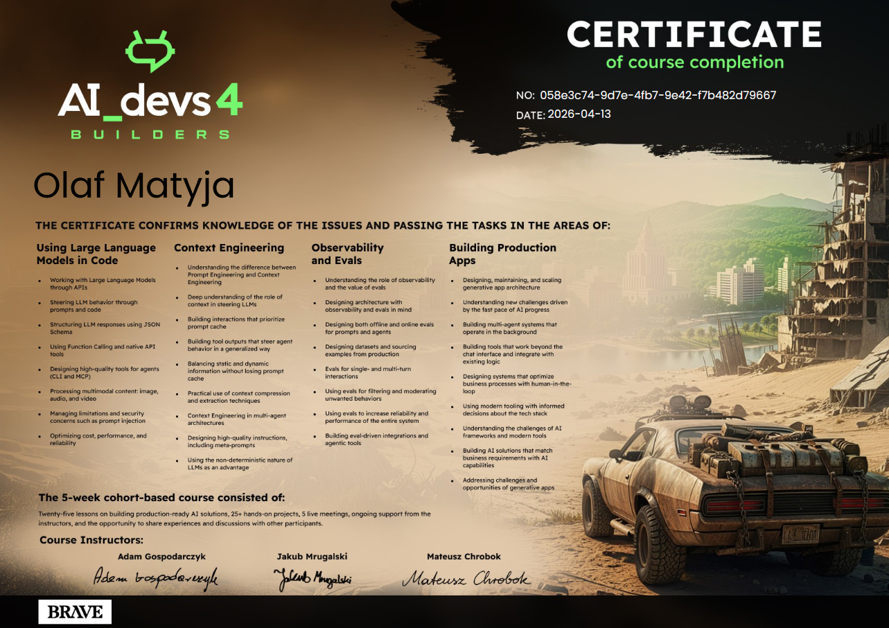

My solutions to the tasks from [AI-devs 4](https://www.aidevs.pl/) challenge.

My goal was to use AI models even when it would have been easier to write code, so that I could understand the limitations of this technology.
I achieved the certificate in the shortest possible time. I think I've never written so many programs in one month! :-)

